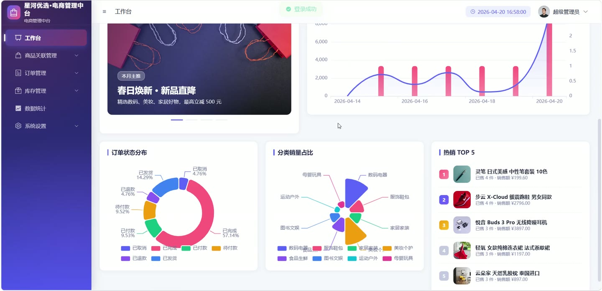
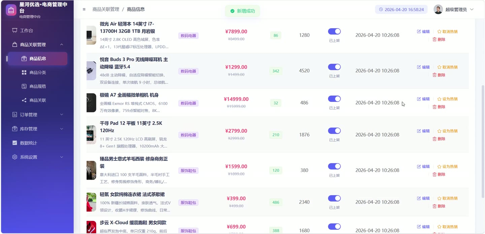
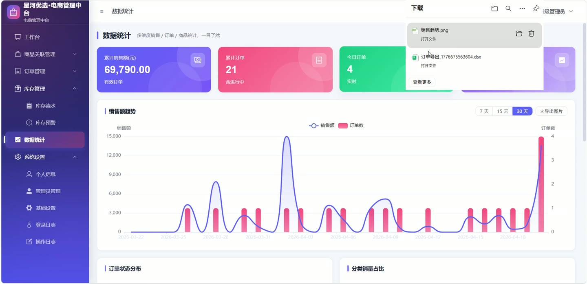

# (附文档)Springboot3+Vue3+MySQL 电商管理系统

**技术栈**：Springboot3、Vue3、MySQL

### 系统简介

星河优选·电商管理中台是一套基于 Spring Boot 3 + Vue 3 前后端分离的企业级电商后台管理系统。系统提供商品管理、订单处理、库存监控、数据统计、权限控制等核心电商运营功能，支持多角色（超级管理员、普通管理员）协同操作，帮助运营团队高效管理电商业务。
 
### 核心功能
 
### 管理员端

 
- 登录：通过账号密码登录，系统记录登录 IP、User-Agent、登录时间及状态（成功/失败），失败原因（账号不存在/密码错误/账号禁用）写入登录日志 
- 登出：前端清除 Token，后端清除当前会话上下文 
- 查看当前登录用户信息：获取当前登录管理员的 ID、用户名、昵称、头像、手机、邮箱、角色、状态 
- 修改个人资料：更新当前登录管理员的昵称、头像、手机、邮箱 
- 修改个人密码：输入原密码和新密码，后端校验原密码正确性后更新密码（BCrypt 加密） 
- 分页查询管理员列表：按用户名/昵称/手机号模糊搜索，不展示超级管理员，返回分页结果 
- 新增管理员：输入用户名、密码、昵称、头像、手机、邮箱、角色、状态，校验用户名唯一性，密码为空时报错 
- 编辑管理员：修改用户名、昵称、头像、手机、邮箱、角色、状态，校验用户名唯一性 
- 删除管理员：按 ID 删除，超级管理员不可删除 
- 重置管理员密码：指定管理员 ID 和新密码，直接更新密码 
- 商品分类管理：分页查询分类列表（支持按名称/状态筛选）、新增分类（校验名称唯一性）、编辑分类、删除分类（校验是否有商品引用） 
- 商品管理：分页查询商品列表（支持按名称/分类/状态筛选，附带分类名称）、新增商品（选择分类、填写名称/价格/库存/描述/图片等）、编辑商品、删除商品（联动删除规格和关联数据）、上架/下架商品 
- 商品规格管理：按商品 ID 查看规格列表、新增规格（规格名/加价/库存）、编辑规格、删除规格 
- 商品关联管理：查看某商品下的关联商品列表（附带关联商品名称/图片/价格）、新增关联（选择关联商品和类型，校验不能关联自身和重复关联）、删除关联 
- 订单管理：分页查询订单列表（支持按订单号/收货人/电话搜索，按状态/时间范围筛选）、查看订单详情（含商品明细列表）、新增订单（选择商品/数量/规格，自动计算总金额，扣减库存并记录出入库流水）、编辑订单（收货信息/备注，已完成/已退款/已取消状态不可编辑）、修改订单状态（待付款→已付款→已发货→已完成，发货时可填物流单号）、删除订单（同时删除订单明细）、导出订单（按搜索条件导出为 Excel 文件） 
- 库存管理：分页查看库存流水（支持按商品名称/类型筛选）、手动出入库调整（选择商品/类型/数量/原因，自动更新库存并记录流水）、查看低库存商品列表（库存 ≤ 最低库存阈值） 
- 数据统计：查看概览数据（总订单数、总销售额、商品总数、低库存数、今日订单数、今日销售额）、近 N 天销售额趋势（日期/金额/订单数）、订单状态分布统计、分类销售统计、商品销售排行（按销量和按销售额） 
- 日志查看：分页查看登录日志（按用户名/IP/消息搜索）、分页查看操作日志（按用户名/模块/操作搜索） 
- 系统设置：查看和修改系统配置列表（键值对形式，支持批量更新） 
- 文件上传：上传图片/文件，校验扩展名白名单，按日期分目录存储，返回访问 URL
 
### 技术栈

  后端框架 Spring Boot 3.2   ORM MyBatis-Plus 3.5   权限认证 JWT（jjwt）+ BCrypt 密码加密   前端框架 Vue 3   状态管理 Pinia   构建工具 Vite   数据库 MySQL 8   Excel 导出 EasyExcel   参数校验 Jakarta Validation 
 
### 交付内容

 
- 后端完整源码 
- 前端完整源码 
- 数据库初始化脚本 
- 万字文档

## 界面展示

---

## 获取完整源码 + 万字文档

本仓库为项目介绍页。**完整前后端源码、数据库初始化脚本、万字项目文档**，请加微信 `kangkangcode`，或访问 [codekk.top](http://codekk.top) 获取。

可作课程设计 / 毕业设计参考，支持远程部署调试。